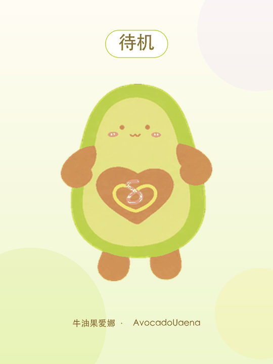
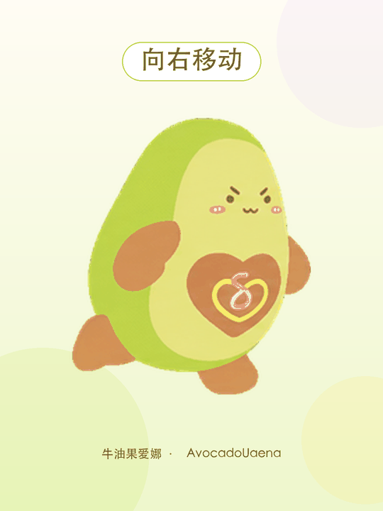
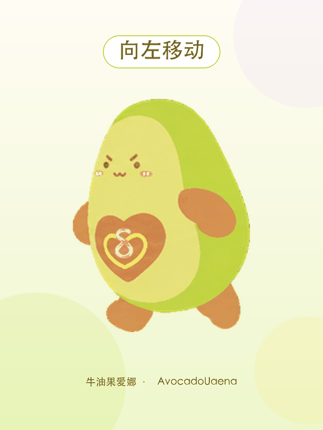
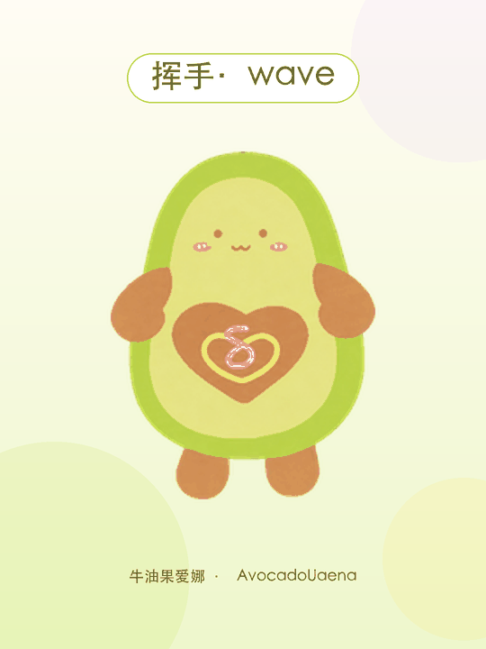
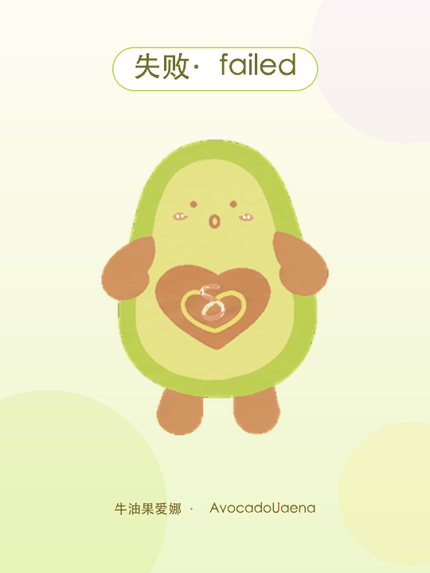
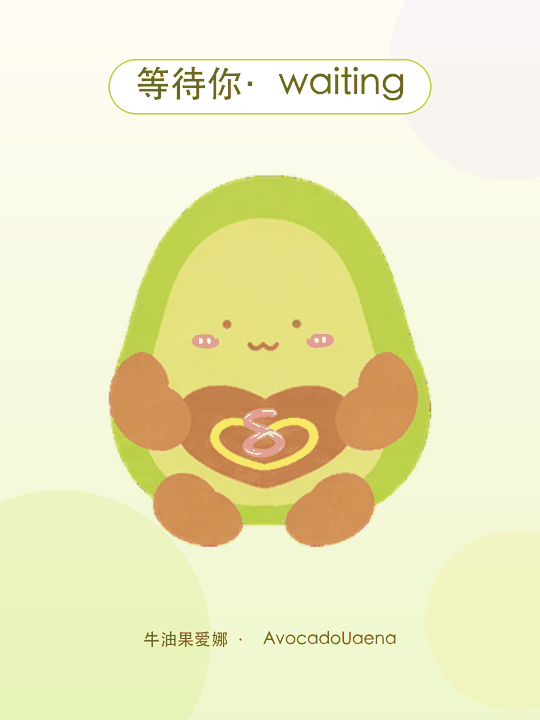
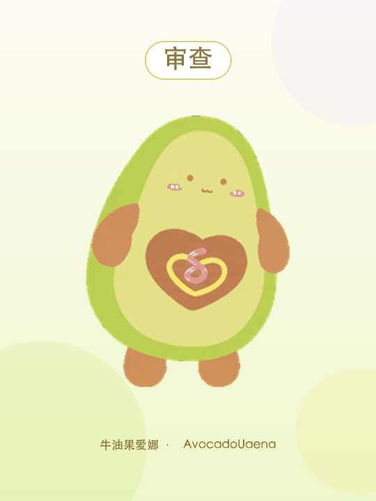

# 牛油果爱娜 · AvocadoUaena

一只以牛油果，腹部装饰着荧光黄与紫色交织的 UAENA logo。

这是一个适用于 Codex Desktop 的 v2 动画宠物，包含待机、左右移动、挥手、跳跃、失败、等待、执行任务、审查以及方向注视动画。

> 非官方粉丝作品，与 OpenAI、IU 官方及 UAENA 官方无隶属或合作关系，仅供个人非商业使用。

## 动作预览

| 待机 | 向右移动 | 向左移动 |
| --- | --- | --- |
|  |  |  |

| 挥手 | 跳跃 | 失败 |
| --- | --- | --- |
|  |  |  |

| 等待你 | 执行任务 | 审查 |
| --- | --- | --- |
|  |  |  |

## 安装

### 方法一：下载发布包

1. 打开仓库右侧的 **Releases**。
2. 下载 `AvocadoUaena-v1.0.0.zip` 并解压。
3. 将解压得到的整个 `AvocadoUaena` 文件夹复制到：

   ```text
   ~/.codex/pets/
   ```

4. 完全退出并重新打开 Codex，在宠物列表中选择“牛油果爱娜”。

### 方法二：克隆仓库后安装

```bash
git clone https://github.com/dlwIrma/AvocadoUaena.git
cd AvocadoUaena
./install.sh
```

## 小红书 Live Photo 素材

在 Releases 下载 `AvocadoUaena-LivePhotos-v1.0.0.zip`。解压后包含 9 个 `.pvt` Live Photo 包：

1. 在 Mac 上双击 `.pvt` 文件，将它导入“照片”App。
2. 通过 iCloud 照片同步或隔空投送到 iPhone。
3. 在小红书选择对应的 Live Photo 发布。

这些素材为 3:4 竖版、1080×1440，每个动作约 3 秒。

## 手动安装结构

```text
~/.codex/pets/AvocadoUaena/
├── pet.json
└── spritesheet.webp
```

宠物图集使用 Codex v2 规范：8×11 网格、单格 192×208、完整图集 1536×2288。

## 卸载

完全退出 Codex 后删除：

```text
~/.codex/pets/AvocadoUaena/
```

然后重新打开 Codex。
